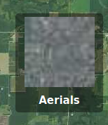
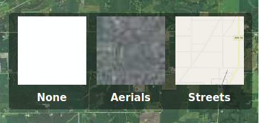

.. _basemap_toggle_plugin:

Basemaps Toggle Plugin
======================

Provides a basemap layers toggle as seen on many popular web-mapping
sites.

Example in the application
--------------------------

Closed:

   Showing the toggle closed

Open:

   Showing the toggle open

Installing
----------

1. Copy ``basemap-toggle.js`` from ``examples/plugin/src`` to the same
   directory as ``app.js``.
2. Before ```` add
   the line:

   ::

       

3. Add a target ``div`` for the plugin:

   Change:

   ::

        

            

        

   To:

   ::

        

            

            

        

4. The following can be added to the Demo's ``app.js`` to demonstrate
   how the basemap toggle is configured. An actual application will have
   different layer names, paths, and preview images.

   Add the following before ``tracker.startTracking();``:

   ::

           app.experimental.addConnectedPlugin(BasemapToggle, 'layer-toggle', {
               layers: [
                   {
                       label: 'None',
                       src: 'data:image/gif;base64,R0lGODlhAQABAIAAAP7//wAAACH5BAAAAAAALAAAAAABAAEAAAICRAEAOw==',
                       path: 'none/none',
                   },
                   {
                       label: 'Aerials',
                       src: 'https://demo.geomoose.org/cgi-bin/mapserv7?SERVICE=WMS&VERSION=1.1.1&REQUEST=GetMap&FORMAT=image%2Fjpeg&LAYERS=mncomp&MAP=%2Fsrv%2Fdemo%2Fsrc%2F3.0%2Fgm3-demo-data%2F.%2Fdemo%2Fwms%2Fwms_proxy.map&SRS=EPSG%3A3857&STYLES=&WIDTH=40&HEIGHT=40&BBOX=-10389135.541557081%2C5535452.120985681%2C-10351566.742154919%2C5566447.33595532',
                       path: 'lmic/mncomp'
                   },
                   {
                       label: 'Streets',
                       src: 'https://a.tile.openstreetmap.org/12/989/1480.png',
                       path: 'openstreetmap/osm_mapnik'
                   }
               ]
           });
