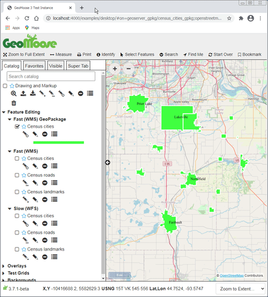

.. _vector-editing-introduction:

Vector Editing Introduction
=====================================================================

   Animation of Vector Editing

The Vector Editing capabilities of GeoMoose allow your users to create, edit, and delete geometry and properties of
point, line, and polygon vector features and save those edits on your server. To enable the editing of features,
you must:

#. Setup a WFS-T 1.1.0 compliant server such as GeoServer or TinyOWS
#. Configure a map-source in your GeoMoose mapbook to enable the editing of the layer

This is a basic walk-through to show how to configure GeoMOOSE to allow editing of features. It will cover two possible WFS-T server configurations:

- :any:`geoserver+geopackage`
- :any:`Mapserver's TinyOWS + PostGIS <tinyows+postgis>`

You will need only one of the two above configurations to experiment with editing vectors with GeoMoose.
Other configurations are possible, such as GeoServer + PostGIS, but are not described here.

.. _vector-editing-tutorial:

Vector Editing Tutorial
=====================================================================

Installing the Demo Data
---------------------------------------------------------------------
GeoServer can use various databases to store data.  The easiest to configure for the purpose of this demo is GeoPackage, a file-based relational database built on SQLite.

- Download the latest release (v3.7 or greater) of the GeoMoose Demo data from `gm3-demo-data <https://github.com/geomoose/gm3-demo-data/releases>`__.
- Unzip the data in a folder of your choice.

.. _geoserver+geopackage:

WFS-T Server: GeoServer + GeoPackage
---------------------------------------------------------------------
These instructions are for GeoServer 2.17.2, but later versions will work and the setup should be similar.
The best documentation on installing and using GeoServer comes from
`GeoServer <http://docs.geoserver.org/stable/en/user/>`__ itself.  Install GeoServer as per the instructions in the
GeoServer documentation, and startup a GeoServer instance
by executing ``Geoserver\bin\startup.sh.`` If you've installed GeoServer on Windows, start GeoServer by executing
``C:\Program Files\GeoServer\bin\startup.bat``, and make sure you run startup.bat with **Administrator** privileges.

Now open a browser and go to http://localhost:8080/geoserver/web/. Login to GeoServer by using the default credentials: username ``admin``, password ``geoserver``.

Configuring GeoServer to Use census.gpkg
~~~~~~~~~~~~~~~~~~~~~~~~~~~~~~~~~~~~~~~~~~~~~~~~~~~~~~~~~~~~~~~~~~~~~
- Note the location of the ``census.gpkg`` file.  It will be in the ``gm3-demo-data/demo/census/`` folder.

Add a New Workspace

#. In the left control-panel column of GeoServer, under the "Data" header, click on "Workspaces".
#. Click the green "+" button.
#. Name the work space ``Geomoose`` with a Namespace URI of ``http://geomoose.demo``.

Add a New Data Store

#. In the left control-panel column of GeoServer, under the "Data" header, click on "Stores".
#. Click the green "+" button to create a new data store.
#. On the New data source page, click on "GeoPackage"
#. Use the following settings:

- Workspace: Geomoose
- Data Source Name: census_data
- Description: Census Data for Demo
- Enabled: Should be checked to indicate "true".
- The rest of the settings are for PostgreSQL, please fill them out to match the information you used to load the shapefile.

Add New Layers
- publish

Enable CORS (if necessary)

.. _tinyows+postgis:

WFS-T Server: TinyOWS + PostGIS
---------------------------------------------------------------------

Install Mapserver's TinyOWS
~~~~~~~~~~~~~~~~~~~~~~~~~~~~~~~~~~~~~~~~~~~~~~~~~~~~~~~~~~~~~~~~~~~~~

Install PostGIS and Load the Places Shapefile
~~~~~~~~~~~~~~~~~~~~~~~~~~~~~~~~~~~~~~~~~~~~~~~~~~~~~~~~~~~~~~~~~~~~~

Install PostGreSQL.  Install `PostGIS <https://postgis.net/>`__. Create a user ``gis`` with a
password of ``super_gis``, create a database named ``gis2`` and grant
all privileges to user ``gis``\ to the ``gis2`` database.

Now load the Places shapefile. There are a couple of good applications
for doing this, GDAL's ``ogr2ogr`` and PostGIS'\ ``shp2pgsql``. Whichever tool you use, the layer should be
named ``census_cities`` for the purposes of this example.

A typical ``ogr2ogr`` string to load the data will look similar to this:

::

    ogr2ogr -f PostgreSQL "PG:dbname=gis2 user=gis password=super_gis" tl_2019_27_place.shp tl_2019_27_place -nln census_cities -nlt GEOMETRY -lco DIM=2

The commands for the other two point and line shapefiles would be:

::

    ogr2ogr -f PostgreSQL "PG:dbname=gis2 user=gis password=super_gis" tl_2019_27_pointlm.shp tl_2019_27_pointlm -nln census_landmarks -nlt GEOMETRY -lco DIM=2
    ogr2ogr -f PostgreSQL "PG:dbname=gis2 user=gis password=super_gis" tl_2019_27_prisecroads.shp tl_2019_27_prisecroads -nln census_roads -nlt GEOMETRY -lco DIM=2

Configure TinyOWS by replacing the content of TinyOWS config.xml with:

.. code:: xml

    <tinyows online_resource="http://localhost/cgi-bin/tinyows.exe"
             schema_dir="/ms4w/apps/tinyows/schema/"
             check_schema="0"
             check_valid_geom="0"
             log="/ms4w/tmp/tinyows.log"
             log_level="15">

    <pg host="localhost" user="postgres" password="postgres" dbname="gis2" port="5432"/>

    <metadata  name="TinyOWS Server"
              title="TinyOWS Server" />

    <contact name="TinyOWS Server"
             site="http://www.tinyows.org/"
             email="tinyows-users@lists.maptools.org" />

    <layer retrievable="1"
           writable="1"
           ns_prefix="Geomoose"
           srid="4326"
           ns_uri="http://localhost/cgi-bin/tinyows.exe"
           name="census_cities"
           title="census_cities"
           table="census_cities"
    />
    <layer retrievable="1"
           writable="1"
           ns_prefix="Geomoose"
           srid="4326"
           ns_uri="http://localhost/cgi-bin/tinyows.exe"
           name="census_roads"
           title="census_roads"
           table="census_roads"
    />
    <layer retrievable="1"
           writable="1"
           ns_prefix="Geomoose"
           srid="4326"
           ns_uri="http://localhost/cgi-bin/tinyows.exe"
           name="census_landmarks"
           title="census_landmarks"
           table="census_landmarks"
    /></tinyows>

To display the vectors, create a Mapserver map file:

.. code::

    MAP
        INCLUDE '../../geomoose_globals.map'
        DEBUG 5
        WEB
            METADATA
                'ows_title' 'GeoMoose Example Census data'
                INCLUDE '../../common_metadata.map'
                'wfs_getfeature_formatlist' 'gml,geojson'
            END
        END

        LEGEND
          STATUS ON
          KEYSIZE 18 12
          # LABEL object
    #      LABEL
    #        TYPE BITMAP
    #        SIZE MEDIUM
    #        COLOR 0 0 89
    #      END
        END

        LAYER
            NAME census_cities
            STATUS ON
            DUMP TRUE

            METADATA
                'ows_title' 'Cities'
                'ows_include_items' 'all'
                'gml_include_items' 'all'
            END

            CONNECTIONTYPE POSTGIS
            CONNECTION "host=localhost dbname=gis2 user=postgres password=postgres"
            DATA "wkb_geometry from census_cities"
            TYPE POLYGON

            PROJECTION
                'init=epsg:4269'
            END

            LABELCACHE ON
    #		LABELMAXSCALE 20000
            CLASS
                NAME 'Cities'
                STYLE
                    WIDTH 3
                    COLOR 180 180 254
                    OUTLINECOLOR 0 0 0
                    OPACITY 50
                END

                LABEL
                    TEXT "[name]"
                    TYPE TRUETYPE
                    FONT vera_sans
                    SIZE 20
                    ANTIALIAS TRUE
                    COLOR 0 0 0
                    OUTLINECOLOR 254 254 200
                    BUFFER 4
                    MINFEATURESIZE auto
                    PARTIALS FALSE
                    POSITION cc
                END
            END
            TEMPLATE 'dummy'
        END
    END ## end Map

Edit the GeoMoose mapbook.xml to include:

.. code:: xml

    <map-source name="tinyows-wfs-polygons" type="wfs" >

        <url>http://localhost/cgi-bin/tinyows.exe</url>
        <param name="typename" value="Geomoose:census_cities" />
        <config name="geometry-name" value="wkb_geometry" />
        <config name="namespace-uri" value="http://localhost/cgi-bin/tinyows.exe" />
        <config name="srs" value="EPSG:4269" />
        <config name="id-property" value="ogc_fid" />

        <!-- make sure there is no tolerance on polygon layers -->
    <!--
        <config name="pixel-tolerance" value="0" />
    -->
        <properties>
            <property name="geoid"    label="GeoID" />
            <property name="name"     label="Name" />
        </properties>

        <!-- the layer name does not need to match the typename but
             it is a good idea.
        -->
        <layer name="census_cities">
            

            <template name="identify"><![CDATA[
                

                    

                        <label>{{ properties.name }}</label>
                    

                    

                        ID: {{properties.geoid}}
                    

                

            ]]></template>
        </layer>
    </map-source>

    <map-source name="tinyows-wms"          type="mapserver" >
        <file>./demo/census/census.map</file>
        <layer name="census_cities"    query-as="tinyows-wfs-polygons/census_cities" >
            <template name="identify"             auto="true"/>
        </layer>>
        <param name="FORMAT" value="image/png"/>
        <param name="TRANSPARENT" value="TRUE"/>
    </map-source>

.. code:: xml

        <group title="Feature Editing" expand="true">
            <group title="WMS + WFS (MapServer + TinyOWS)"    expand="true">
                <layer
                    title="Census cities"
                    src="tinyows-wms/census_cities"
                    draw-edit="true"
                    draw-modify="true"
                    draw-polygon="true"
                    draw-remove="true"
                />
            </group>
        </group>

Using Vector Editing
=====================================================================
Only some layers in the Catalog will be enabled for editing.  If a layer is enabled for editing, you will see a pencil icon next to the layer name.

Tour of the editing tools
---------------------------------------------------------------------

How to digitize new features
---------------------------------------------------------------------

How to edit exiting features
---------------------------------------------------------------------
