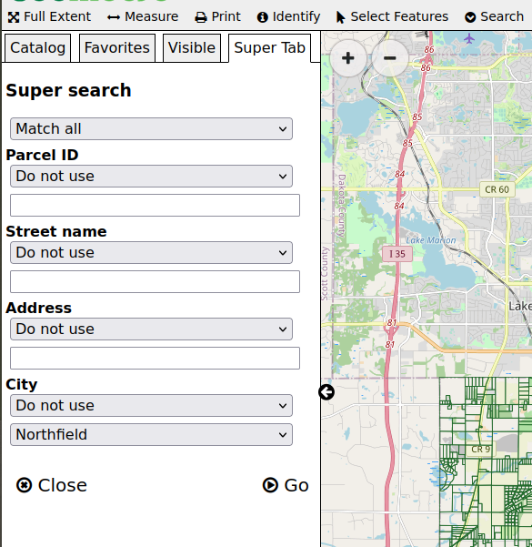

How-to add a multi-field complex search
=======================================

The code below shows a very complex example of a data search
that is intended for power users. It uses GeoMoose's demo-parcel
layer.

Configure the search service
----------------------------

In ``app.js``, a new search service needs configured for that layer:

.. code:: javascript

    // The `operators` array is a handy short cut
    //  for setting search options below.
    const operators = [
      {value: '', label: 'Do not use'},
      {value: 'ilike', label: 'Similar to'},
      {value: 'eq', label: 'Equal to'}
    ];
    // Register the new "super search"
    app.registerService('search-super', SearchService, {
        // set the title for use in the super-tab.
        title: 'Super search',
        // specify the vector-parcels dataset.
        searchLayers: ['vector-parcels/parcels'],
        // This configures the form for the user to use to search.
        fields: [
          {type: 'select', label: '', name: 'and_or', options: [
            {value: 'and', label: 'Match all'},
            {value: 'or', label: 'Match any'}
          ]},
          {type: 'select', label: 'Parcel ID', name: 'pin_op', options: [
            {value: '', label: 'Do not use'},
            {value: 'in', label: 'In list'},
            {value: 'eq', label: 'Is equal to'}
          ]},
          {type: 'text', label: '', name: 'pin_value'},
          {type: 'select', label: 'Street name', name: 'street_op', options: operators},
          {type: 'text', label: '', name: 'street_value'},
          {type: 'select', label: 'Address', name: 'address_op', options: operators},
          {type: 'text', label: '', name: 'address_value'},
          {type: 'select', label: 'City', name: 'city_op',
            options: [
              {value: '', label: 'Do not use'},
              {value: 'eq', label: 'Is equal to'}
            ]
          },
          // These cities are in the parcel dataset in all caps,
          //  this filter uses "eq" which requires the caps and spelling
          //  match the value of the field in the data.
          {type: 'select', label: '', name: 'city_value',
            options: [
              {value: 'NORTHFIELD', label: 'Northfield'},
              {value: 'FARMINGTON', label: 'Farmington'}
            ]
          }
        ],
        prepareFields: function(fields) {
            const query = [];
            // convert the fields into a an object to make
            //   lookup in the loop easier.
            const values = {};
            fields.forEach(function(field) {
                values[field.name] = field.value;
            });
            // the fields names in the form are generic,
            //  this is the list of field names in the datset
            const fieldLookup = {
                pin: 'PIN',
                street: 'STREETNAME',
                address: 'BLDG_NUM',
                city: 'CITY'
            };
            // iterate through the list of generic field names
            ['pin', 'street', 'address', 'city'].forEach(function(input) {
                // check to see if the user specified an operator
                const op = values[input + '_op'];
                // translate the form's field name to the data's field name
                const fieldName = fieldLookup[input];
                // get the value from the user's entry.
                const fieldValue = values[input + '_value'];
                // The "ilike" operator ignores case and allows for partial matches.
                if (op === 'ilike') {
                    query.push({
                        comparitor: 'ilike',
                        name: fieldName,
                        value: '%' + fieldValue + '%'
                    });
                } else if (op === 'in') {
                  // "in" is a meta-operator, it needs converted to
                  // an "or" query.
                  const values = fieldValue.replace(' ', '').split(',');
                  query.push(['or'].concat(values.map(function(value) {
                    return {
                      comparitor: 'eq',
                      name: fieldName,
                      value: value,
                    };
                  })));
                } else if (!!op) {
                    // trust that the specified operator exists
                    // In this example the only other operator is 'eq'
                    query.push({
                        comparitor: op,
                        name: fieldName,
                        value: fieldValue
                    });
                }
            });
            // when the user chooses "match any" do an "or" query instead of "and"
            if (values['and_or'] === 'or') {
                return [['or'].concat(query)];
            }
            return query;
        }
    });

Add the search service to the toolbar
-------------------------------------

In the ``mapbook.xml``:

1. Find the ``<toolbar>`` element.
2. Inside the ``<toolbar>`` element, add the follow entry for the new
   search service:

   .. code:: xml

       <tool name="search-super" css-class="tool search" title="Super search" type="service"/>
