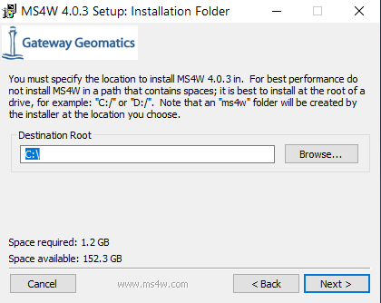

# MS4W Quickstart

Requirements:

 * A computer running Windows 7 or newer.
 * Download the latest copy of MS4W.  [Download Here.](http://ms4w.com)
 * Download the latest copy of the GeoMoose Demo Data. [Download Here.](https://www.geomoose.org/downloads/gm3-demo-data-3.0.0-beta-ms4w.zip)
 * Download the latest version of the GeoMoose MS4W Package [Download Here.](https://www.geomoose.org/downloads/gm3-examples-3.0.0-beta-ms4w.zip)

## Install MapServer for Windows

MapServer for Windows will install the base files required by GeoMoose along with an Apache service to actually serve GeoMoose. Once installed, navigate to localhost for more detail  Also, full description of optional packages in the installer are found on ms4w.com.

MapServer for Windows does come with an older version of GeoMoose, but it is recommended to skip that and install the latest and greatest version for the full Moose experience.

The MapServer for Windows installer will prompt for a path. GeoMoose is set up and expects to run from the default path (C:\ms4w\apps\gm3\htdocs\ ), so please leave it set to C:\.  This will also make all future updates and enhancements to the application simpler.

Lastly, MapServer for Windows will ask to specify the Apache port. There is no reason to change this unless port 80 is already in use. Also, if you install another web service in the future that uses port 80, you may want to reconfigure it to run a different port.

You can validate the ms4w installation by navigating to localhost, where you will be greeted by the MS4W MapServer introduction and features.

## Install the GeoMoose Demo Data

Extract the `gm3-demo-data-3.0.0-beta-ms4w.zip` to the C directory. This will unzip mapfiles and shapefiles used to power the GeoMoose examples.

## Install GeoMoose

Extract the `gm3-examples-3.0.0-beta-ms4w.zip` to the C directory. Everything in it is already set to install where needed within the ms4w subdirectories including Apache, Apps, and httpd.d.

Once extracted, restart the Apache MS4W Service.

GeoMoose will now show up on the MS4W localhost page under applications

Click a link to launch the Desktop or Mobile version of GeoMoose.

