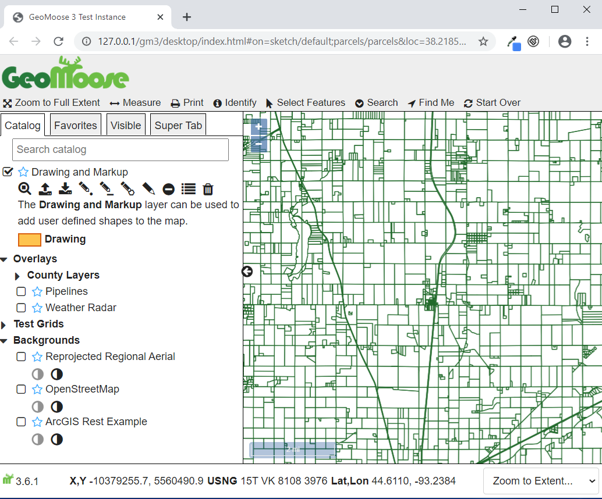

## About this workshop

* Learn how to install GeoMoose, add data to the application, and customize the look and feel.
* This workshop assumes the use of MS4W as the installation platform. GeoMoose is Linux/UNIX/OS-X
  friendly and is, in fact, developed on Linux but the install on Linux is out of the scope
  of this workshop.

## Who is this workshop for?

* Anyone wanting to have a WebGIS application for their users.
* "GIS Admins" - People who have data and want to get it out.
* Developers who don't want to repeat themselves.

# Installing MS4W

## Getting started with MS4W

MapServer for Windows (MS4W) will install the base files required by GeoMoose
along with an Apache service to actually serve GeoMoose. Once installed,
navigate to localhost for more detail
Also, full description of optional packages in the installer are found on ms4w.com.

Requirements:

 * A computer running Windows 7 or newer.
 * A copy of MS4W.  [Download Here.](http://ms4w.com)
 * A copy of the GeoMoose Demo Data. [Download Here.](https://www.geomoose.org/downloads/gm3-demo-data-3.0.0-ms4w.zip)
 * A copy of the GeoMoose MS4W Package [Download Here.](https://www.geomoose.org/downloads/gm3-examples-3.0.0-ms4w.zip)


## Install MS4W

**Double click the ms4w-3.2.2-setup.exe icon.**


MapServer for Windows does come with an older version of GeoMoose,
but it is recommended to skip that and install the latest and greatest version
for the full Moose experience.


## Select "C:\\"

The MapServer for Windows installer will prompt for a path. GeoMoose is set up and expects to run from the default path (`C:\ms4w\apps\gm3\htdocs\`), so please leave it set to `C:\`.  This will also make all future updates and enhancements to the application simpler.


## Keep it real, Keep it Port 80

Lastly, MapServer for Windows will ask to specify the Apache port. There is no reason to change this unless port 80 is already in use. Also, if you install another web service in the future that uses port 80, you may want to reconfigure it to run a different port.


## Open MS4W!

You can validate the ms4w installation by navigating to [localhost](http://localhost:80), where you will be greeted by the MS4W MapServer introduction and features.


# Installing GeoMoose

## Install the GeoMoose Demo Data

Extract the `gm3-demo-data-3.0.0-ms4w.zip` to the `C:\` directory. This will unzip mapfiles and shapefiles used to power the GeoMoose examples.


## Install the GeoMoose SDK and examples

Extract the `gm3-examples-3.0.0-ms4w.zip` to the `C:\` directory. Everything in it is already set to install where needed within the ms4w subdirectories including Apache, Apps, and httpd.d.


## Restart Apache

Once extracted, restart the Apache MS4W Service.


## Back to the browser

GeoMoose will now show up on the MS4W [localhost](http://localhost/) page under applications


Click a link to launch the Desktop or Mobile version of GeoMoose.

## Look at that!




# Time to play

# Learning the insides of GeoMoose

## GeoMoose vocabulary

* GeoMoose - Javascript SDK
* Mapbook XML - Main configuration file.
    * Has `map-source` entries.
    * Defines the catalog and toolbar.
* Mapfile - OSGeo MapServer configuration files.
* 'Application JS' or `app.js` - File that defines the actual application behaviour.
* 'Application HTML' - Usually `index.html`, defines the look and feel of the application, includes all the Javascript files.

## Visual of GeoMoose app structure


*Darker shading indicates the degree of affect for files during a GeoMoose 3 upgrade.*

## What does the app look like?


## Starting a fresh GeoMoose Application

* Goto `C:\ms4w\apps\gm3\htdocs`.
* Copy `desktop/` to `workshop/`.
* Open the new [http://localhost/gm3/workshop/](http://localhost/gm3/workshop/)

## Adding a MapServer source

### What is MapServer?
* Lightweight, OGC standards compliant, CGI-based map rendering engine.
* Configured with "Mapfiles"
* *GeoMoose provides shortcuts for working with MapServer as a WMS using its type="mapserver"
  map-sources*.

## Batteries are included with Firestations

* The firestations layer is included with the GeoMoose 3 Demo Data.
* Open `C:\ms4w\apps\gm3\htdocs\workshop\mapbook.xml`
* Add the following after line 5:
    ```xml
    <map-source name="firestations" type="mapserver">
        <file>./demo/firestations/firestations.map</file>
        <layer name="fire_stations"/>
    </map-source>
    ```
* This will add the `firestations` source with a `fire_stations` layer.

## The firestations.map file

`firestations.map` can be found installed on `C:\ms4w\apps\gm3-demo-data\demo\firestations\firestations.map.`

### Mapfile "preamble"
```
MAP
    # Include commonly re-used GeoMoose parameters
    INCLUDE '../../geomoose_globals.map'

    # The web section defines more metadata for the map
    # that can be used with OGC services.
    WEB
        METADATA
            'ows_title' 'County Firestations'
            INCLUDE '../../common_metadata.map'
        END
    END
```

## firestations.map - Layer definition

```
    LAYER
        NAME 'fire_stations'
        STATUS ON
        METADATA
            'ows_title' 'Fire Stations'
            'ows_include_items' 'all'
            'gml_include_items' 'all'
            'ows_exclude_items' 'SHAPE_area,SHAPE_len'
            'gml_exclude_items' 'SHAPE_area,SHAPE_len'
        END
        TYPE POINT
        DATA 'firestations'
        PROJECTION
            'init=epsg:26915'
        END
        CLASS
            NAME 'Fire Stations'
            STYLE
                COLOR 254 0 0
                SYMBOL 'star'
                SIZE 8
            END
        END
        TOLERANCE 10
        TEMPLATE 'dummy'
    END # End of Layer
```

## firestations.map - End of the map!
```
END # End of Map
```

## Add Firestations to the catalog

* GeoMoose separates the difference between the source-data with
  `<map-source />` es and presentation with the use of the `<catalog>`.
* In `mapbook.xml` goto line 445 and add the following on the next line:
    ```xml
    <layer src="firestations/fire_stations" title="Firestations"/>
    ```
* This will add the `fire_stations` layer of the `firestations` source
  to the catalog with the label "Firestations".

---

* "Hard" Reload the Browser or clear-the-cache and reload.
  *Pro tip: Chrome can be very aggressive at caching AJAX loaded XML.*

* The catalog should now have a 'Firestations' layer at the top!


## Adding identify to Firestations

* WMS has the GetFeatureInfo request which GeoMoose will use to fetch feature data.
* For a layer to work with identify it needs to have a `<template>` named `identify`
* In the `mapbook.xml` file update the `firestations` `<map-source>` definition:

<!--  -->
```xml
    <map-source name="firestations" type="mapserver">
        <file>./demo/firestations/firestations.map</file>
        <layer name="fire_stations">
            <template name="identify"><![CDATA[
            <div class="result-item">
                <div class="result-title">
                Firestation
                </div>
                <b>Station City:</b> {{ properties.Dak_GIS__4 }}<br>
                <b>Station Number:</b> {{ properties.Dak_GIS__5 }}<br>
            </div>
            ]]></template>
        </layer>
    </map-source>
```
<!--  -->

## More information on templates

* GeoMoose has a rich template system provided by Mark.up.
  [More information on GeoMoose templates here.](http://geomoose.github.io/gm3/templates.html)
* Features in GeoMoose are processed through the templates as
  [GeoJSON](http://geojson.org). For example:

```javascript
  {
    "type": "Feature",
    "geometry": {
        "type": "Point",
        "coordinates": [0, 0]
    },
    "properties": {
        "label": "Null Island",
        "partyScope": 555
    }
  }
```

## How does identify work?

1. It's included in the `index.html` file:
    ```html
    <script type="text/javascript" src="../geomoose/dist/services/identify.js"></script>
    ```

2. Then registered in the `app.js` file:
    ```javascript
    app.registerService('identify', IdentifyService);
    ```

3. And finally, put on the toolbar in the `mapbook.xml` file.
    ```xml
    <tool name="identify" title="Identify" type="service"/>
    ```

## Learning more about identify and services

* Open `geomoose/dist/services/identify.js` in an editor.

* From the GeoMoose website, services are defined as:

    > A service is used to collect information from the user and the map then
    use that information to generate a query.  After the query has executed, the results are then rendered
    into HTML.

* Not all `<map-source>`es are equal!
Previous versions of GeoMoose used PHP to query data.  Now, GeoMoose uses WMS, WFS,
and ArcGIS FeatureServices to perform those queries. To get full querying capabilities
from a layer it needs to have a `mapserver-wfs`, `wfs` or `ags-vector` source.

## Adding select

* To be able to select features from a layer it needs to be configured as WFS.
* The following needs added after line 5 in `mapbook.xml`:

<!--  -->
```xml
<map-source name="firestations-wfs" type="mapserver-wfs">
    <file>./demo/firestations/firestations.map</file>
    <param name="typename" value="ms:fire_stations" />
    <layer name="fire_stations" selectable="true" title="Firestations">
        <template name="select"><![CDATA[
        <div class="result-item">
            <div class="result-title">
            Firestation
            </div>
            <b>Station City:</b> {{ properties.Dak_GIS__4 }}<br>
            <b>Station Number:</b> {{ properties.Dak_GIS__5 }}<br>
        <div>
        ]]></template>
    </layer>
</map-source>
```
<!--  -->

## Reload and select Firestations

* Back in the browser, reload the page, and click 'Select' from the toolbar.
* Use the dropdown to select "Firestations", draw a Polygon on the map, and click "Go".


## More on vector layers

* GeoMoose 3 has been designed with a "vector first" philosophy.
* MapBox GL Styles can be used to style vector layers for rendering in the browser.
* There are additional examples in the example `mapbook.xml`.

# Customizing the GeoMoose application

## Configuring GeoMoose components

* Open `app.js` in an editor.
* The gm3.Application's `add` function accepts three parameters:
  1. The component class.
  2. The DOM element ID where the component.
  3. The optional properties for the component.

## Configure Coordinate Display

* The coordinate display shows the mouse position as the user moves
  the cursor across the map.
* This X,Y is in the map's configured coordinate system. As the
  examples are configured to use the Google Maps projection, that is
  not going to be useful.
* In `app.js` on line 60, you can see the definition of the UTM-15 projection:
    ```
    app.addProjection({
        ref: 'EPSG:26915',
        def: '+proj=utm +zone=15 +ellps=GRS80 +datum=NAD83 +units=m +no_defs'
    });
    ```
* To use UTM-15 make the following change:
    ```
            ref: 'xy'
    ```
    to:
    ```
            ref: 'EPSG:26915'
    ```


## GeoMoose is very HTML, such CSS.

* Chrome and Firefox both have excellent DOM/CSS Inspection tools.
* GeoMoose's desktop example will try to load `site.css` from `index.html`.
  This file is intentionally not included.  `site.css` provides a place
  for custom CSS themes that will not ever be overwritten during upgrades.

## Let's tweak the toolbar!

* Let's assume 'Find Me' does not need a label.
* In `C:\ms4w\apps\gm3\htdocs\workshop\` create a new `site.css` file.
* Add the following:

```css
.toolbar .tool.findme .label {
    display: none;
}
```

## And change the icon!

```css
/* Remove the webfont icon */
.toolbar .tool.findme .icon:before {
    content: '';
}

/* Add the moose! */
.toolbar .tool.findme .icon {
    width: 1em;
    height: 1em;
    box-sizing: border-box;
    background-image: url(./logo-mini.png);
}
```

* More info is available in the GeoMoose [How-to style the toolbar guide.](http://geomoose.github.io/gm3/howto/style-the-toolbar.html)

## Put a sweet gradient on the header

```css
#header {
    background: linear-gradient(to right, lightgreen, grey);
}
```

# Adding a GeoJSON file

## Getting a GeoJSON file

GeoJSON files are stored statically! No MapServer is involved in the serving
or rendering of a GeoJSON file with GeoMoose.

A great example is the `cities.geojson` file. [It can be downloaded from here](https://github.com/mahemoff/geodata/raw/master/cities.geojson) and placed in the the `workshop/` directory.

## Add the new map-source

In `mapbook.xml` after line 5 add:

<!--  -->
```
<map-source name="cities" type="geojson">
    <url>./cities.geojson</url>
    <layer name="all-cities">
        <style><![CDATA[
        {
            "circle-radius" : 5,
            "circle-color": "blue",
            "text-font": ["Arial", "Open Sans Regular"],
            "text-field": "{city}",
            "text-jusitfy": "right",
            "text-anchor": "right"
        }
        ]]></style>
    </layer>
</map-source>
```
<!--  -->

## Add cities to the catalog

* Find `<catalog>` in the mapbook.
* After the `<catalog>` tag add:

    ```xml
    <layer src="cities/all-cities" title="World Cities" />
    ```

## Important notes on GeoJSON layers

1. They cannot yet be used for querying.
2. They are styled using a subset of [MapBox GL Styles](https://www.mapbox.com/mapbox-gl-js/style-spec/).

   The package used by GeoMoose to translate the MapBox GL styles to OpenLayers styles is
   actively being updated and GeoMoose will follow its progress.

# Thank you and happy Moose-ing!
