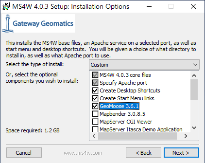
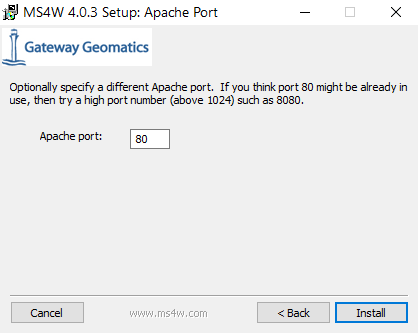
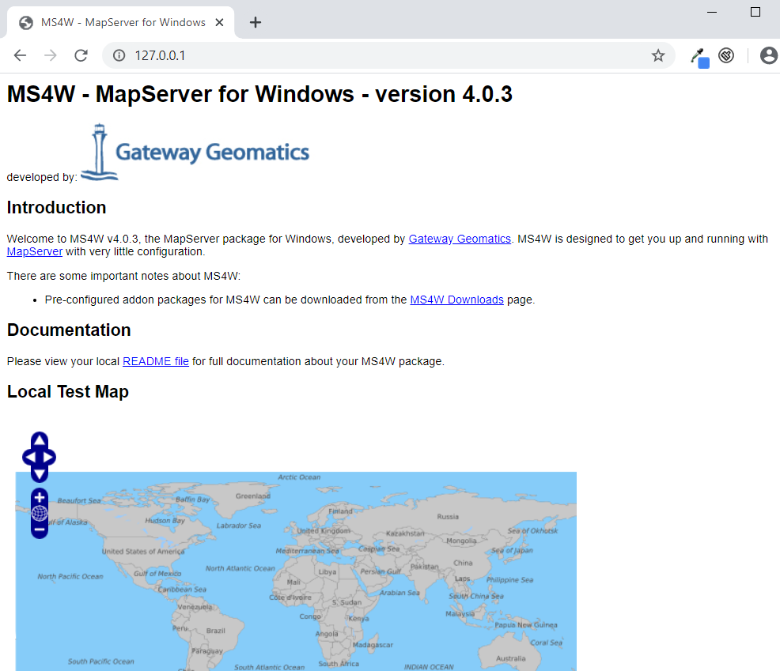

## About this workshop

* Learn how to install GeoMoose, add data to the application, and customize the look and feel.
* This workshop assumes the use of MS4W as the installation platform. GeoMoose is Linux/UNIX/OS-X
  friendly and is, in fact, developed on Linux but the install on Linux is out of the scope
  of this workshop.

## Who is this workshop for?

* Anyone wanting to have a WebGIS application for their users.
* "GIS Admins" - People who have data and want to get it out.
* Developers who don't want to repeat themselves.

# Installing MS4W

## Getting started with MS4W

MapServer for Windows (MS4W) will install the base files required by GeoMoose along with an Apache service to actually serve GeoMoose. Once installed, navigate to localhost for more detail  Also, full description of optional packages in the installer are found on ms4w.com.

Requirements:

 * A computer running Windows 7 or newer.
 * A copy of MS4W.  [Download Here.](http://ms4w.com)
 * A copy of the GeoMoose Demo Data. [Download Here.](https://www.geomoose.org/downloads/gm3-demo-data-3.0.0-ms4w.zip)
 * A copy of the GeoMoose MS4W Package [Download Here.](https://www.geomoose.org/downloads/gm3-examples-3.0.0-ms4w.zip)

## Install MS4W

**Double click the ms4w-3.2.2-setup.exe icon.**

MapServer for Windows does come with an older version of GeoMoose, but it is recommended to skip that and install the latest and greatest version for the full Moose experience.

## Select "C:\\"

The MapServer for Windows installer will prompt for a path. GeoMoose is set up and expects to run from the default path (`C:\ms4w\apps\gm3\htdocs\`), so please leave it set to `C:\`.  This will also make all future updates and enhancements to the application simpler.

## Keep it real, Keep it Port 80

Lastly, MapServer for Windows will ask to specify the Apache port. There is no reason to change this unless port 80 is already in use. Also, if you install another web service in the future that uses port 80, you may want to reconfigure it to run a different port.

## Open MS4W!

You can validate the ms4w installation by navigating to [localhost](http://localhost:80), where you will be greeted by the MS4W MapServer introduction and features.

# Installing GeoMoose

## Install the GeoMoose Demo Data

Extract the `gm3-demo-data-3.0.0-ms4w.zip` to the `C:\\` directory. This will unzip mapfiles and shapefiles used to power the GeoMoose examples.

## Install the GeoMoose SDK and examples

Extract the `gm3-examples-3.0.0-ms4w.zip` to the `C:\\` directory. Everything in it is already set to install where needed within the ms4w subdirectories including Apache, Apps, and httpd.d.

## Restart Apache

Once extracted, restart the Apache MS4W Service.

---

GeoMoose will now show up on the MS4W localhost page under applications

Click a link to launch the Desktop or Mobile version of GeoMoose.

## Look at that!

